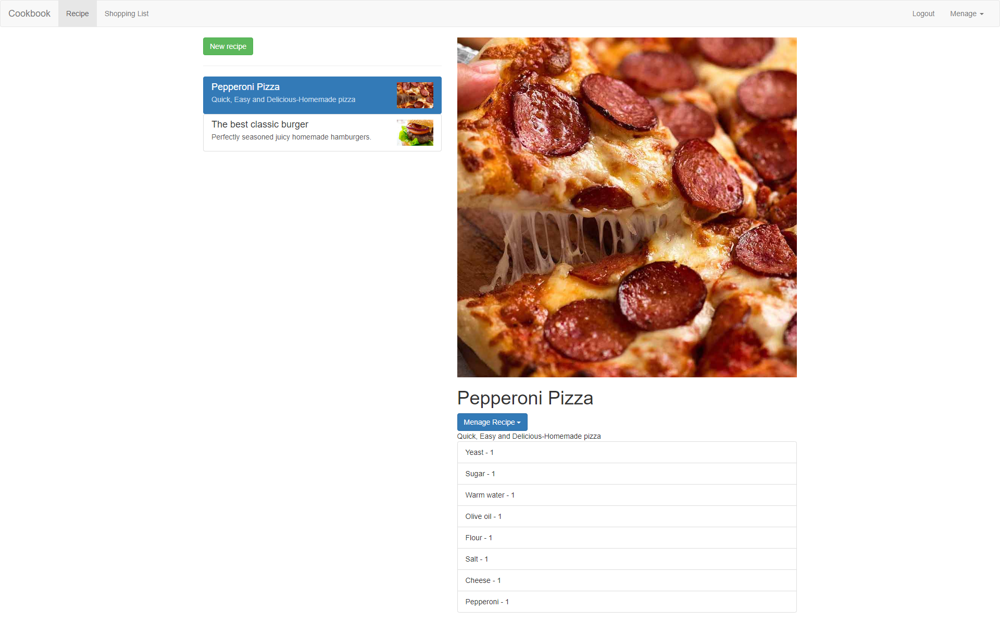
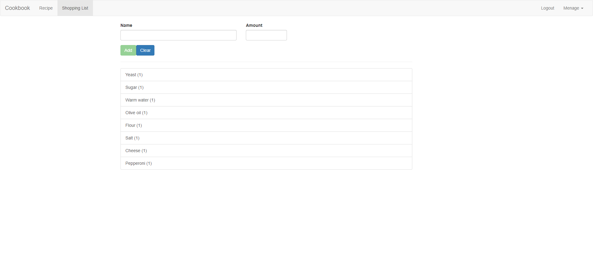

# Cookbook
Angular App

## Table of contents
* [General info](#general-info)
* [Technologies](#technologies)
* [Try out](#try-out)
* [Todo](#todo)
* [Demo](#demo)
* [Sources](#sources)

## General info

Angular app - recipe book. Allows the users to store recipes and create shopping lists from them

## Technologies
* Angular 2+
* Firebase

## Try out
 Website of app:
 https://cookbook-2317d.web.app/

## Demo
Recipes page:

  

  
Shopping-list page:

  

## Todo

Things to do to improve app:
* Add units to ingredients
* Authorize users recipes
* Improve UI
* Add macros and calories to the dishes
* Tag ingredients and group them together on shopping list - Vegetables, bread, etc.
* Allow uploading images
* Export shopping list for example to .pdf

## Sources
This app is based on Angular - The Compleate Guide by Maximilian Schwarzmüller on Udemy.  
https://www.udemy.com/course/the-complete-guide-to-angular-2/
